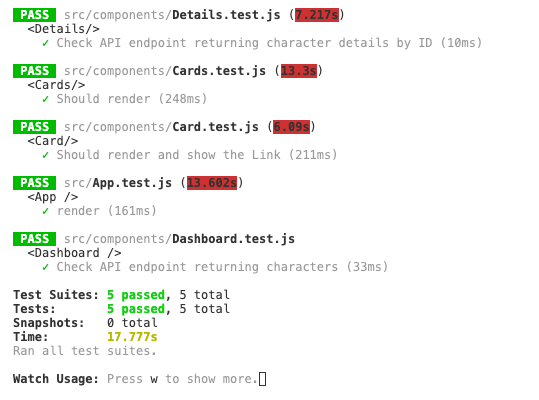

# Marvel Cards

Este projeto é um web app que lista cards da Marvel possibilitando busca por nome e detalha cada personagem mostrando as Séries vinculadas a ele.

Você pode ver o projeto rodando em modo produção aqui: [https://marvelchallenge.herokuapp.com/](https://marvelchallenge.herokuapp.com/)

## Screenshots


## Bibliotecas utilizadas

- axios - Usada para acessar as APIs.
- react-helmet - gerenciamento de SEO.
- moment - Lidar com datas e/ou timestamps.
- react-loadable - Carregamento de páginas assincronas.
- redux - Gerenciamento de status a nível global.
- redux-persist - Midleware para gerenciar o redux.
- react-router-dom - Gerenciar Rotas e navegação em nossa aplicação.
- react-highlight-words - Melhor experiência visual na busca marcando a palavra buscada nos resultados.
- md5 - Em virtude da API da marvel necessitar do codigo md5 da concatenação das chaves e timestamp.
- react-icons - obter opções de icons.
- jest - Testes Unitários.
- chai - Prover melhor experiência nos testes unitários.
- enzyme - Ter maior opções nos testes.

## Getting Started

1. Obter as credenciais na [API da Marvel](https://developer.marvel.com/documentation/getting_started)
2. Configurar as variáveis de ambiente:

- _REACT_APP_private_key_
- _REACT_APP_public_key_
- _NODE_ENV_

### Prerequisitos

1. NodeJS/npm previamente instalado.

### Instalando as dependências

```
yarn
```

ou

```
npm install
```

## Rodando os Testes

```
yarn test
```
### Você verá algo como:



## Rodando o projeto

```
yarn start
```

## Construído com

- [ReactJS](https://pt-br.reactjs.org/) - Biblioteca Front-end.
- [Ant Design](https://ant.design/) - React UI library utilizado.
- [API Marvel](https://developer.marvel.com/docs) - API da marvel.

## Autor

- **Eder Taveira** - [edertaveira](https://github.com/edertaveira)

## Licença

Este projeto pertence à [Squadra Tecnologia](https://www.squadra.com.br/).
