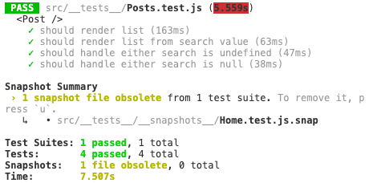

# Question 2

Create a react app that displays a list of posts from the specified REST API. Each post should display the title and body of the post, and username and city of the User that created it. When a client visits the page, the app should generate a random number that becomes the Client Id. The Client Id should be saved in browser local storage, unless an Id already exists. Bonus points for saving the API data in browser local storage and retrieving it on a subsequent visit.

Notes
Feel free to start with create-react-app to save time setting up

Backend APIs
https://jsonplaceholder.typicode.com/posts
https://jsonplaceholder.typicode.com/users


## URL


## Libraries

- axios - Used to do html requests
- react-helmet - SEO handling.
- react-loadable - Asyncronous loading.
- redux - Global State handling.
- redux-persist - Redux Midleware.
- react-router-dom - Managing Routes.
- react-highlight-words - To Highlight search word.
- md5 - To generate the cliente ID.
- react-icons - Icons.
- jest - Unit Tests.
- chai - Unit Tests.

## Getting Started


### Prerequisites

NodeJS/npm previously installed.

### Dependences

```$ yarn ``` ou ```$ npm install ```

### Steps
1. ```$ git clone https://github.com/edertaveira/HealthIQ.git ```
2. ```$ cd  HealthIQ/question2```
3. ```$ yarn start```

## Tests

```
$ yarn test
```



## Running

```
$ yarn start
```

## Built with

- [ReactJS](https://pt-br.reactjs.org/)
- [Ant Design](https://ant.design/) - React UI.

## Autor

- **Eder Taveira** - [edertaveira](https://github.com/edertaveira)

## Licence

This project is powered by [Health IQ](https://healthiq.com)
